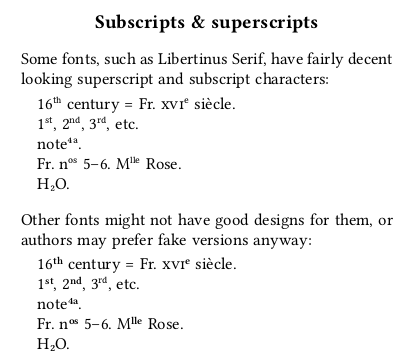

# textsubsuper.sile

[](LICENSE)
[](https://github.com/Omikhleia/textsubsuper.sile/actions?workflow=Luacheck)
[](https://luarocks.org/modules/Omikhleia/textsubsuper.sile)

This package for the [SILE](https://github.com/sile-typesetter/sile) typesetting
system provides ways to typeset superscripted or subscripted text properly,
using real characters (i.e. based on OpênType font properties) or fake (scaled
and raised) characters, with several tuning options.

As it names imply, it is not a general-purpose super/subscript package, but it
operates on text:

- Detecting and using, when available, OpenType font features for “real” superscripts
  or subscripts
- Scaling and raising (or lowering) characters in the “fake” case, with special
  provisions for digits and character weight.

In other words, it aims at providing a standardized way to get a “decent typographical”
output for superscripted or subscripted text, with appropriate fallbacks.



## Installation

This package require SILE v0.14 or upper.

Installation relies on the **luarocks** package manager.

To install the latest development version, you may use the provided “rockspec”:

```
luarocks --lua-version 5.4 install --server=https://luarocks.org/dev textsubsuper.sile
```

(Adapt to your version of Lua, if need be, and refer to the SILE manual for more
detailed 3rd-party package installation information.)
